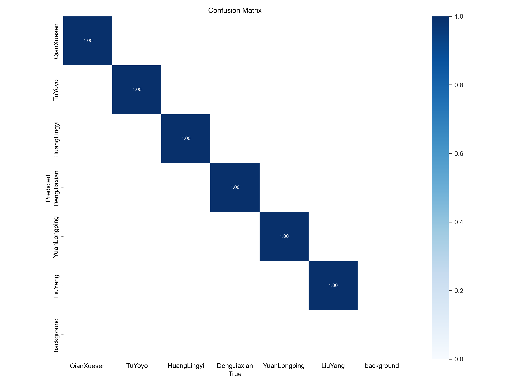
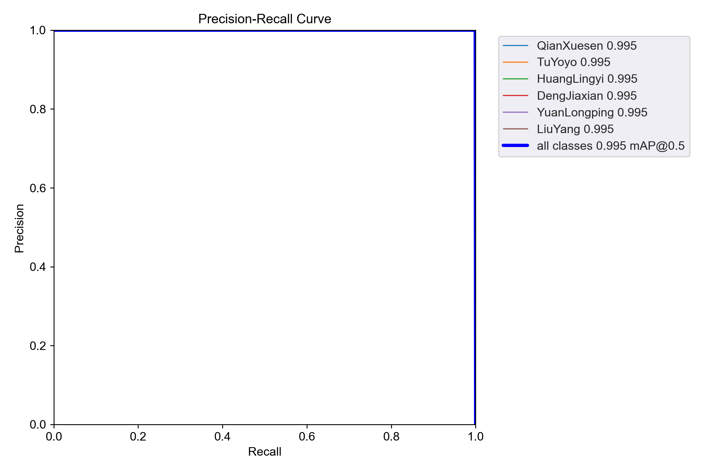
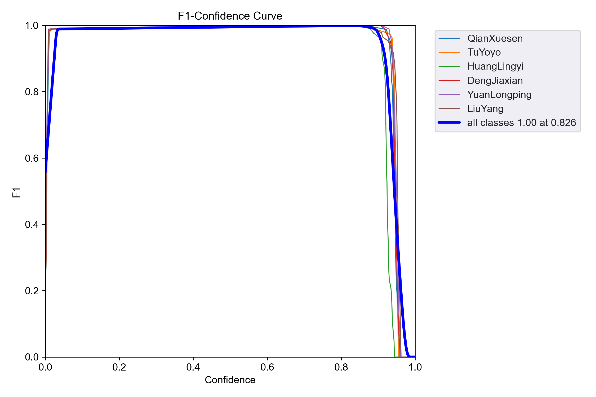

<h1 align="center">🚗 ImageRecognition — YOLOv5 Face / Cloud Inference</h1>
<p align="center">
轻量 &amp; 易上手：电脑跑模型，小车 / 手机只需浏览器即可拍照‑识别。
</p>

---

## ✨ 功能亮点
| 模块 | 说明 |
|------|------|
| **YOLOv5‑Face** | 已训练权重 `weights/face04.pt`，适配 2025 青科赛人脸识别附加任务 |
| **PC 离线推理** | `python demo_pc.py` — 本机相册 / 摄像头调试 |
| **🚀 云端推理** | `python demo_cloud.py` 在 Mac/MiniPC 启动 Flask<br>浏览器访问 `http://<IP>:1999` → 实时预览、拍照上传、返回标注图 |
| **小车零环境** | 小车只需打开浏览器访问页面；无需在小车端装 PyTorch |
| **Android 调试** | 同一 Wi‑Fi 下手机直接访问；HTTPS 或 Chrome flag 皆可开启摄像头 |

---

## 🛠️ 快速开始

```bash
git clone https://github.com/ZJ-Dragon/ImageRecognition.git
cd ImageRecognition
python -m venv venv && source venv/bin/activate
pip install -r requirements.txt  # 含 torch, flask, opencv-python-headless…
```

### 1️⃣ 本机离线推理
```bash
python demo_pc.py --weights weights/face04.pt --imgsz 640
```

### 2️⃣ 局域网云端推理  
```bash
python demo_cloud.py            # 默认 0.0.0.0:1999
# 浏览器访问 http://<MAC_IP>:1999
```
> **Chrome 摄像头**：若提示不安全，可自签 HTTPS 或在 `chrome://flags/#unsafely-treat-insecure-origin-as-secure` 添加白名单。  

---

## 📁 项目结构
```
.
├── demo_pc.py            # 离线推理
├── demo_cloud.py         # Flask 服务
├── static/               # 前端 HTML / JS / CSS
├── utils/                # letterbox 等工具
├── models/               # YOLOv5 模型源码（已修复 torch2.7 安全加载）
└── runs/train/face04/    # 训练结果与权重
```

---

## 📊 face04 训练结果

| 指标 | 图片 |
|------|------|
| Confusion Matrix |  |
| PR Curve |  |
| F1 Curve |  |

更多详情请查看 `runs/train/face04/` 目录。

---

## 📝 FAQ

- **utils.datasets 缺失？** 本仓库自带精简版 `utils/datasets.py`，无需完整 YOLOv5。
- **PyTorch 2.6+ 报 _pickle.UnpicklingError？** 已在 `models/experimental.py` 延迟白名单注册 `DetectionModel` 并显式 `weights_only=False`。
- **Chrome 无法调用摄像头？** 参考上文 Chrome flag 或自签证书。

---

## 🙏 致谢
- [ultralytics/yolov5](https://github.com/ultralytics/yolov5) 提供核心检测框架  
- 所有测试同学 & 竞赛参赛者提供反馈  
